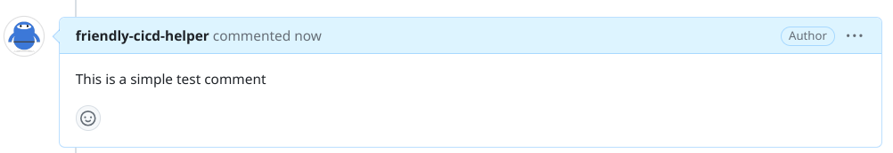
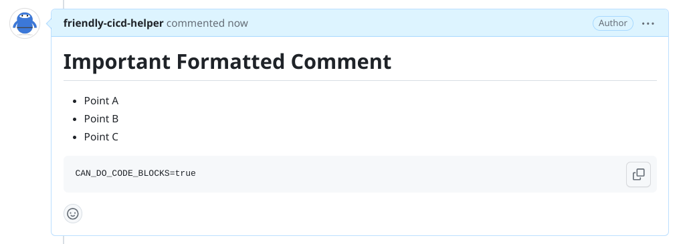
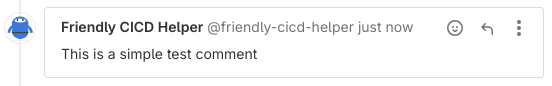

# Using the friendly-cicd-helper

## Understand Code Changes with Vertex AI

For this example we experiment we base our code comment functionality on code changes in the form of a unified git diff.

If you don't have a code base ready that you would like to explore the friendly-cicd-helper with, you could use the following snippet to create a simple diff based on the GCP Cloud Foundations Fabric repository:

```sh
git clone https://github.com/GoogleCloudPlatform/cloud-foundation-fabric.git

cd cloud-foundation-fabric
git diff 3a248~ 3a248 > git.diff
GIT_DIFF_PATH="$PWD/git.diff"
```

As the `friendly-cicd-helper` will use a Vertex AI endpoint in Google Cloud you'll also need to configure the Google Cloud project where the Vertex AI is enabled:

```sh
export VERTEX_GCP_PROJECT=
```

### Generate a Summary for Code Changes

You can use the following command to generate comments on the code changes:

```sh
python friendly-cicd-helper.py vertex-code-summary --diff $GIT_DIFF_PATH
```

If you used the demo git diff from above this should output something like the following:

```md
**Cleanup Policies:**

- The module now supports defining cleanup policies for Artifact Registry repositories.
- Cleanup policies allow you to automatically manage the lifecycle of versions in your repository based on various criteria.
- You can define multiple cleanup policies and apply them to a repository.
- Each cleanup policy can specify an action (KEEP or REMOVE) and conditions for when the action should be applied.
- Conditions can be based on factors such as tag state, tag prefixes, package name prefixes, version name prefixes, and age of versions.
- The module also supports a `cleanup_policy_dry_run` variable that allows you to preview the effects of cleanup policies without actually deleting any versions.

**Additional Changes:**

- The module now uses the `google-beta` provider for the `google_artifact_registry_repository` resource.
- The `docker_config` dynamic block has been updated to address a permadiff issue.
- The `variables.tf` file has been updated to include the new `cleanup_policies` and `cleanup_policy_dry_run` variables.
- A new example YAML file (`cleanup-policies.yaml`) has been added to demonstrate how to use cleanup policies with the module.
```

### Generate a PR/MR Comment

You can use the following command to generate comments on the code changes in a Merge Request or Pull Request:


```sh
python friendly-cicd-helper.py vertex-code-summary --diff $GIT_DIFF_PATH
```
If you used the demo git diff from above this should output something like the following:

```md
The code review for the provided Git diff:

## General Comments:
- The code seems well-structured and organized, with clear separation of concerns between modules.
- The variable names are descriptive and follow a consistent naming convention, which enhances readability.
- The use of `tftest` blocks for testing is a good practice and helps ensure the correctness of the Terraform configuration.

## Specific Suggestions:

### 1. Cleanup Policies:
- In the `main.tf` file, the `cleanup_policies` dynamic block is missing a `content` block for the `most_recent_versions` field. This should be added to specify the criteria for keeping the most recent versions of artifacts.

### 2. `google_artifact_registry_repository` Resource:
- In the `main.tf` file, the `google_artifact_registry_repository` resource is missing a `name` argument. This is a required field and should be set to a unique name for the repository.

### 3. `cleanup_policy_dry_run` Variable:
- The `cleanup_policy_dry_run` variable is not documented in the `variables.tf` file. It would be helpful to add a description and specify the default value (if any) for this variable.

### 4. `cleanup-policies.yaml` File:
- In the `cleanup-policies.yaml` file, the `values` section is repeated twice. This seems to be an unnecessary duplication and can be removed.

### 5. Comments:
- While the code is generally well-commented, there are a few places where additional comments could improve clarity. For example, adding comments to explain the purpose of the `cleanup_policies` variable and the `cleanup_policy_dry_run` variable would be helpful.

Overall, the codebase appears to be well-structured and follows best practices. By addressing the suggestions mentioned above, you can further enhance the readability, maintainability, and testability of the code.
```

### Generate Release Notes

You can use the following command to generate release notes for code changes:

```sh
python friendly-cicd-helper.py vertex-release-notes --diff $GIT_DIFF_PATH
```

If you used the demo git diff from above this should output something like the following:

```md
**Release Notes**

- Added support for cleanup policies in Artifact Registry repositories.
- Added a new variable `cleanup_policies` to specify the cleanup policies for a repository.
- Added a new variable `cleanup_policy_dry_run` to prevent the cleanup pipeline from deleting versions in a repository.
- Updated the `google_artifact_registry_repository` resource to support the new cleanup policies and variables.
- Added an example of how to use the new cleanup policies in the `tests/modules/artifact_registry/examples/cleanup-policies.yaml` file.
```

## Comment on a Github Issue or PR

### With a simple `--comment` parameter:

```sh
docker run --env GITHUB_TOKEN=$GITHUB_TOKEN friendly-cicd-helper github-comment  \
  --repo friendly-cicd-helper/test-comments \
  --issue 1 \
  --comment "This is a simple test comment"
```

Which should add an issue comment like this:



### With content from STDIN

````sh
cat <<"EOF" | docker run -i --env GITHUB_TOKEN=$GITHUB_TOKEN friendly-cicd-helper github-comment --repo friendly-cicd-helper/test-comments --issue 1
# Important Formatted Comment 

* Point A
* Point B
* Point C

```sh
CAN_DO_CODE_BLOCKS=true
```
EOF
````

Which should add an issue comment like this:



## Comment on a Gitlab Issue

```sh
docker run --env GITLAB_TOKEN=$GITLAB_TOKEN friendly-cicd-helper gitlab-comment  \
  --repo friendly-cicd-helper/demo \
  --issue 1 \
  --comment "This is a simple test comment"
```

Which should add an issue comment like this:



## Putting everything together

The commands are designed to be composable such that you can generate code summary, release notes, and comments with Vertex and then pipe the output to the comment functionality to comment on a GitHub or Gitlab issue or MR/PR.

```sh
python friendly-cicd-helper.py vertex-code-summary --diff $GIT_DIFF_PATH | \
python friendly-cicd-helper.py gitlab-comment  \
  --repo friendly-cicd-helper/demo \
  --issue 1
```


## Using the friendly-cicd-helper with Google Cloud Build

See example pipeline in [./demo-pipeline/gitlab-comment.yaml](./demo-pipeline/gitlab-comment.yaml).
